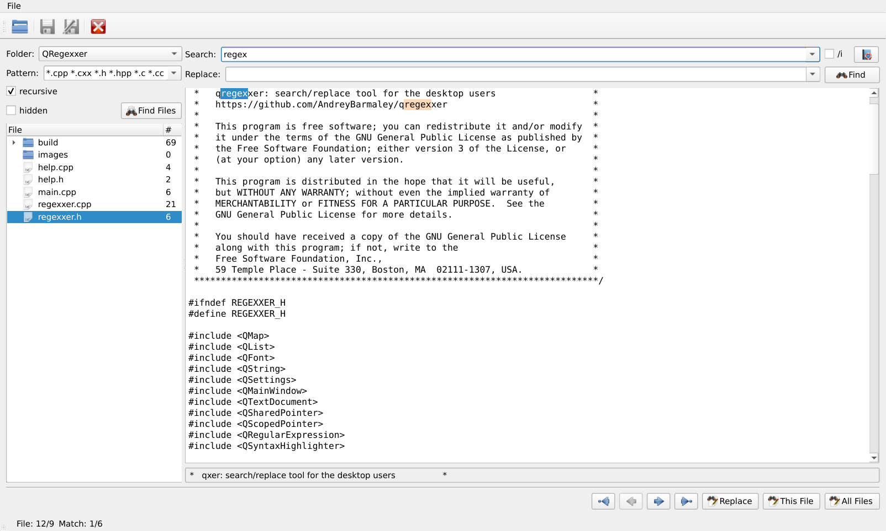

# qregexxer
**QRegexxer** is a graphical application for Linux designed for convenient work with regular expressions (regex).

It allows you to test and apply regular expressions to files and text contents right inside the program. This is useful for developers, administrators, and anyone else who often has to search and replace strings using regular expression templates.

## main dependencies
- Qt5/Qt6 libs

## build instructions
```
cmake -B build
cmake --build build
```

## screenshot

